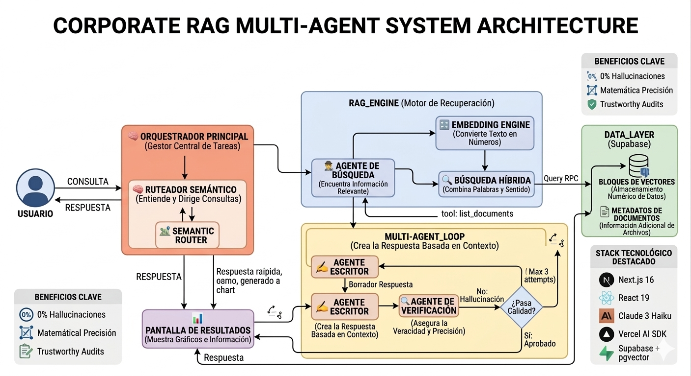

# Enterprise RAG Auditor — Corporate Multi-Agent System

Sistema de auditoría documental con IA que permite a empresas consultar, analizar y verificar documentos corporativos con **0% de alucinaciones**. Sube un PDF, hazle preguntas, y el sistema te responde exclusivamente con lo que dice el documento — citando las fuentes exactas.

**Demo en producción:** https://multiagente-rag.vercel.app

---

## Arquitectura



El sistema opera como una cadena de agentes especializados:

| Agente | Rol |
|--------|-----|
| **Orquestador Principal** | Gestor central de tareas — coordina el flujo completo |
| **Ruteador Semántico** | Entiende la intención de la consulta y decide el camino (respuesta rápida vs. búsqueda profunda) |
| **Agente de Búsqueda** | Recupera los fragmentos más relevantes del documento usando búsqueda híbrida (semántica + keywords) |
| **Embedding Engine** | Convierte texto en vectores numéricos para comparación semántica |
| **Agente Escritor** | Redacta la respuesta estructurada basada en el contexto recuperado |
| **Agente de Verificación** | Audita la respuesta contra el documento original — rechaza si detecta alucinación (máx. 3 intentos) |

---

## Funcionalidades

- **Ingesta de PDFs** — Sube documentos extensos; el sistema los divide en chunks y los indexa con embeddings
- **Chat RAG** — Consultas en lenguaje natural respondidas exclusivamente con contenido del documento
- **0% Alucinaciones** — El Agente Verificador garantiza que cada dato numérico citado exista textualmente en el documento
- **Generación de gráficos** — Cuando la respuesta incluye datos cuantitativos, el sistema genera charts interactivos automáticamente
- **Visualizador vectorial** — Panel en tiempo real que muestra los chunks indexados como scatter plot (proyección PCA 2D)
- **Motor híbrido** — Combina búsqueda semántica (pgvector) con búsqueda por keywords (full-text) para máxima precisión
- **Multi-tenant** — Cada usuario tiene su espacio aislado con RLS a nivel de base de datos

---

## Tech Stack

| Capa | Tecnología |
|------|------------|
| Framework | Next.js 16 + React 19 + TypeScript |
| AI Engine | Vercel AI SDK v5 + Claude Sonnet 4.6 (Anthropic) |
| Router | Claude 3 Haiku (clasificación de intención) |
| Embeddings | sentence-transformers (Python pipeline) |
| Base de datos | Supabase + pgvector (búsqueda híbrida) |
| Auth | Supabase Auth (Email + Google OAuth) |
| Estilos | Tailwind CSS 3.4 |
| Estado | Zustand |
| Deploy | Vercel |

---

## Setup Local

### 1. Instalar dependencias

```bash
npm install
```

### 2. Variables de entorno

```bash
cp .env.example .env.local
```

Completar en `.env.local`:

```env
NEXT_PUBLIC_SUPABASE_URL=tu_supabase_url
NEXT_PUBLIC_SUPABASE_ANON_KEY=tu_anon_key
SUPABASE_SERVICE_ROLE_KEY=tu_service_role_key
ANTHROPIC_API_KEY=tu_anthropic_key
NEXT_PUBLIC_SITE_URL=http://localhost:3000
PYTHON_BIN=/ruta/a/python3
```

### 3. Base de datos

Aplicar las migraciones en orden desde `supabase/migrations/`:

```bash
# Via Supabase Dashboard → SQL Editor, o con Supabase CLI:
supabase db push
```

### 4. Pipeline de embeddings (Python)

```bash
cd src/features/ai/scripts
pip install -r requirements.txt
```

### 5. Correr el servidor

```bash
npm run dev
```

---

## Flujo de uso

1. **Login** — Ingresa con email o Google
2. **Sube un PDF** — Arrastra el archivo al panel izquierdo
3. **Espera la indexación** — El pipeline Python genera embeddings y los almacena en Supabase
4. **Consulta** — Escribe tu pregunta en el chat; el sistema busca, redacta y verifica la respuesta
5. **Visualiza** — El panel vectorial muestra los clusters de chunks de tus documentos en tiempo real

---

## Estructura del proyecto

```
src/
├── app/
│   ├── (auth)/login & signup    # Autenticación
│   ├── api/chat                 # Streaming RAG endpoint
│   ├── api/upload               # Ingesta de PDFs
│   ├── api/documents            # CRUD documentos
│   └── api/chunks/positions     # Coordenadas 2D para visualizador
│
├── features/ai/
│   ├── components/
│   │   ├── AgentFlowVisualizer  # Pipeline de agentes en tiempo real
│   │   ├── VectorDBInspector    # Scatter plot de chunks (PCA 2D)
│   │   ├── DocumentUpload       # Ingesta de PDFs
│   │   └── ArchitectureDiagram  # Diagrama del sistema
│   ├── services/rag-agents      # Lógica de búsqueda híbrida
│   └── scripts/ingest_pipeline  # Pipeline Python de embeddings
│
supabase/migrations/             # Schema completo + pgvector + RLS
```

---

*Enterprise RAG Auditor — Respuestas verificadas, nunca alucinadas.*
